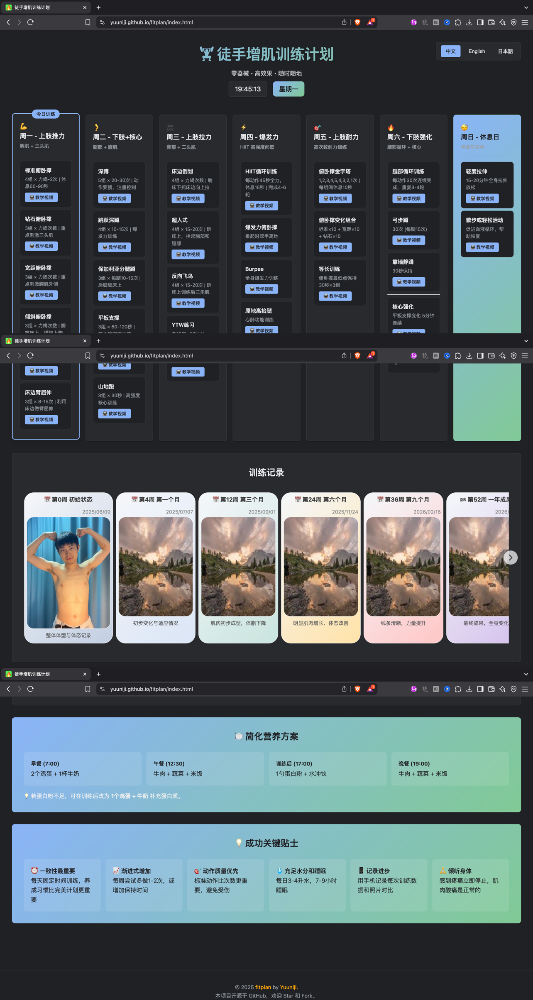

# FitPlan / 徒手增肌训练计划 / 自重筋トレ計画

[](https://yuuniji.github.io/fitplan/index.html)
[](https://github.com/yuuniji/fitplan)
[](https://github.com/yuuniji/fitplan)

A multi-language (🇨🇳 中文 / 🇬🇧 English / 🇯🇵 日本語) webpage for a **no-equipment bodyweight workout plan**, designed to help build muscle anywhere, anytime.

🌐 **[Live Demo →](https://yuuniji.github.io/fitplan/index.html)**



---

## 🇬🇧 English

A responsive, multi-language workout site for muscle gain using only bodyweight.

### Features

* 7-day structured workout plan
* Switch between Chinese, English, and Japanese (auto-saves preference)
* Progress tracking, nutrition guidance, and tips
* Mobile-friendly responsive design

### Run Locally

```bash
git clone https://github.com/yuuniji/fitplan.git
cd fitplan
# Open index.html in your browser
```

### Tech Stack

* HTML, CSS, JavaScript (all in `index.html`)

---

## 🇨🇳 简体中文

一个多语言响应式网页，提供无需器械的徒手增肌训练计划。

### 功能特色

* 7 天训练日程安排
* 中、英、日语言切换（自动保存偏好）
* 训练进度、营养建议与成功技巧
* 适配手机与电脑的响应式设计

### 本地运行

```bash
git clone https://github.com/yuuniji/fitplan.git
cd fitplan
# 用浏览器打开 index.html 文件
```

### 技术栈

* HTML、CSS、JavaScript（全部写在 `index.html` 中）

---

## 🇯🇵 日本語

器具不要の自重トレーニングプランを提供する多言語対応のレスポンシブウェブページです。

### 主な特徴

* 7日間のトレーニングスケジュール
* 中国語・英語・日本語の切り替え（設定を自動保存）
* 進捗・栄養・成功のヒント付き
* スマホ対応のレスポンシブデザイン

### ローカル実行

```bash
git clone https://github.com/yuuniji/fitplan.git
cd fitplan
# ブラウザで index.html を開く
```

### 技術構成

* HTML、CSS、JavaScript（すべて `index.html` に埋め込み）

